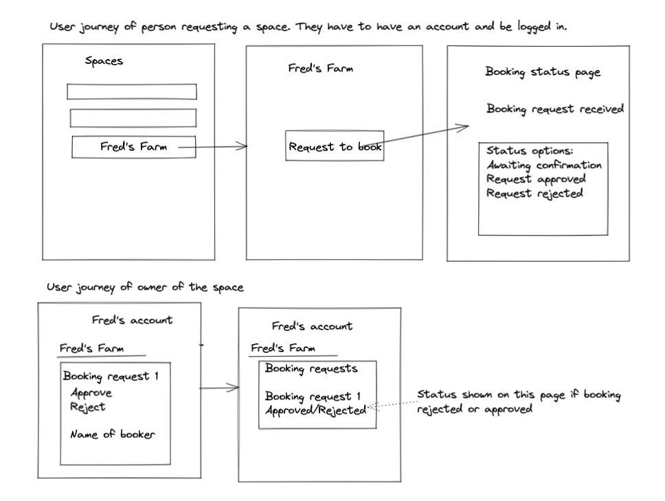
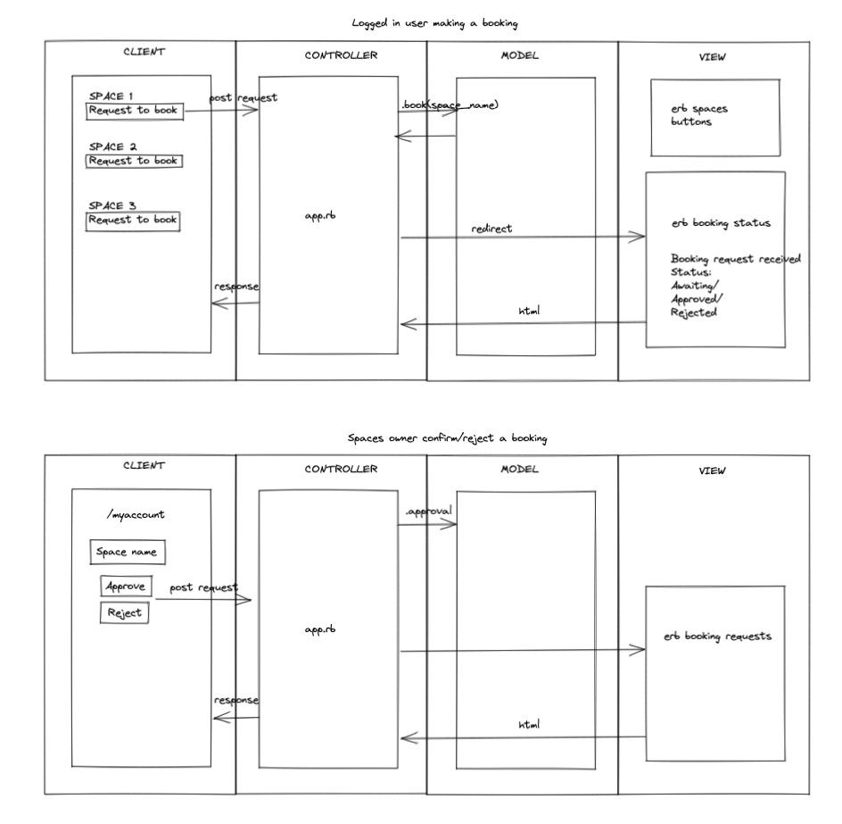
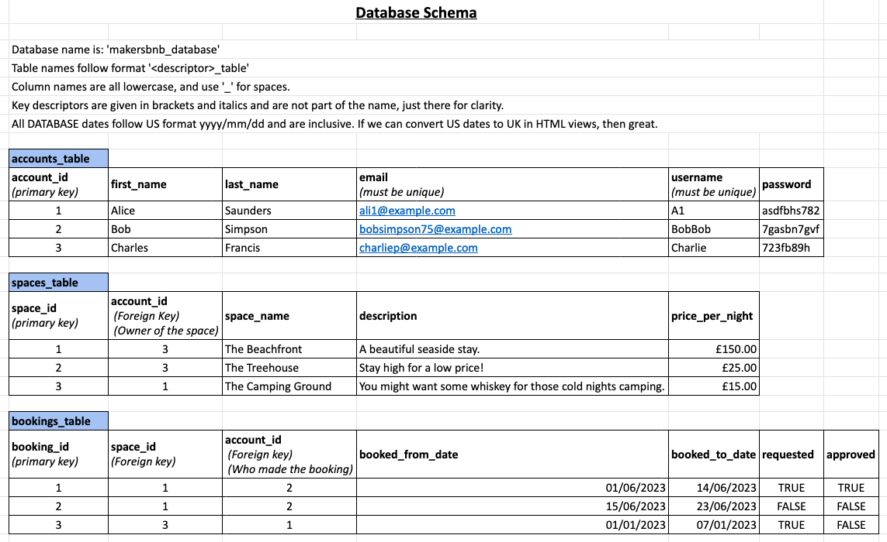

## makers_bnb

A web application that allows users to list spaces they have available, and to hire spaces for the night.

## User stories
As a user,
I would like to list a new space
So that others can see my listing

As a user,
I want to be able to view all spaces,
so that I can see what's available and make a choice

As a user,
I want to add a name, a short description and a price per night,
so that I can personalise my listing

As a user,
I would like to request to hire a space,
So that I can stay

Diagrams:
-------
MVC

-------

## Getting started

`git clone https://github.com/fridayshoes/makers_bnb.git`

## List of GEMS
gem 'sinatra'
gem 'sinatra-contrib'
gem 'puma'
gem 'pg'
gem 'rspec'
gem 'simplecov', require: false
gem 'simplecov-console', require: false
gem 'capybara'

## Usage
In command line type `rackup` to start the app
Navigate to local host (usually 9292)

## Database set up 
- Open PSQL
- Create 'MakersBNB_database' postgres db locally
- Create 'MakersBNB_database_test' postgres db locally
- Create 'accounts_table,'spaces_table' and 'bookings_table' tables using the SQL code in db folder

## Running tests

In command line type `rspec` 
